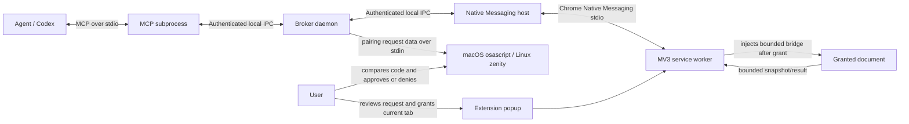

# Architecture

## Status

This document describes the current TabGrant Developer Preview implementation.
Future or unverified behavior is explicitly labeled. It is not a production
security certification.

## Context

TabGrant mediates between an MCP client and one explicitly granted document in a
user's existing Chromium-based browser. It does not copy the browser profile or
give the client ambient access to every tab.



On macOS and Linux, broker IPC is a filesystem Unix-domain socket. The broker
path abstraction uses a named pipe on Windows. It does not open a TCP loopback
listener. The browser native-host installer is currently implemented only for
macOS and Linux. Production browser pairing uses a broker-owned OS prompt on
macOS/Linux and fails closed on Windows.

## Implemented components

### MCP adapter and broker

The MCP adapter exposes nine typed tools and connects to the broker over local
IPC. If no broker is available and the persistent kill marker is absent, the MCP
adapter or Native Messaging host can start it.

The broker:

- validates strict wire schemas and authenticates each connection;
- creates an unexposed random session ID for every accepted connection;
- owns pending requests, leases, budgets, revocation, and audit decisions;
- prevents a second connection from reusing state based only on matching
  `clientId` and `taskId` strings;
- revokes an agent connection's pending requests and leases on disconnect;
- routes only authorized typed commands to the registered browser connection;
- denies unknown methods and ambiguous state.

### Native Messaging host

The host translates framed Chrome Native Messaging messages to the broker's local
RPC protocol. The browser manifest restricts the host to the exact installed
extension ID. The host has no independent tab-selection authority.

The installer publishes the manifest create-only and refuses to replace an
existing path. Uninstall pins the inspected inode and bytes, refuses a concurrent
replacement, and is idempotent when the path is already absent. Reconfiguration
therefore requires an explicit uninstall before reinstall.

### Browser extension

The Manifest V3 extension uses `activeTab`, `scripting`, `nativeMessaging`, and
`storage`; it declares no persistent host permissions or static content scripts.
It:

- stores a non-extractable P-256 signing key in IndexedDB and a rotating,
  single-attempt 160-bit code in `chrome.storage.session`;
- starts pairing only from the trusted popup's parameter-free **Pair this extension**
  action;
- displays pending access requests and the **Client-declared model provider**
  label;
- grants only the current eligible HTTPS or loopback-HTTP tab after user action;
- holds at most one active grant, replacing the prior grant when necessary;
- binds execution to browser instance, tab, document ID, origin, scope, and
  expiry;
- injects a content bridge only after the grant action;
- rechecks live tab origin and document identity before commands;
- tears down or revokes on document change, close, disconnect, expiry, or user
  revoke.

The automated Chrome harness does not change this production authority model. It
copies the built extension to a temporary directory and adds only
`http://127.0.0.1/*` to the copy so a headless synthetic page can be exercised.
The harness opens the popup programmatically; it is evidence for the downstream
broker/Native-Messaging/popup/bridge chain, not for a real toolbar gesture granting
production `activeTab` authority.

### Content bridge

The injected bridge implements four operations: bounded accessibility-style
snapshot, highlight, scroll, and teardown. Same-origin navigation is performed by
the service worker and then revokes the replaced document lease. Snapshot refs
are valid only for their document and snapshot epoch.

### Protocol and policy packages

Runtime schemas reject unknown fields, wildcard identities, insecure non-loopback
HTTP origins, privileged browser scopes, password-form actions, and arbitrary
execution actions. The policy package models additional risk classes for future
work, but the current MCP/extension surface does not expose click, form, submit,
publish, purchase, delete, screenshot, cookie/storage, arbitrary JavaScript, or
CDP operations.

## Connection and lease lifecycle

1. The MCP subprocess or Native Messaging host reads the owner-only IPC secret and
   authenticates to the broker using a timestamped HMAC proof and one-time nonce.
2. After authentication, the broker assigns that connection a random internal
   session ID. The ID is not supplied by the client or exposed in public results.
3. The agent requests scopes, a human-readable reason, and optionally page-data
   egress with a `declaredModelProvider` label.
4. The extension shows the request. The label is a client declaration, not a
   verified identity or enforceable destination.
5. The user grants the current tab. The broker binds the new lease to the requesting
   connection session, browser instance, tab, document, origin, scopes, and
   budgets.
6. Each command is checked against the owning session, active lease, scope, signed
   capability, live browser context, and resource budgets.
7. The browser executes the typed operation. Snapshot results are measured as
   serialized UTF-8 JSON before return.
8. Agent disconnect, browser disconnect, document replacement, expiry, revoke,
   exhausted use budget, or persistent kill invalidates the lease.

A new connection with identical public `clientId` and `taskId` values receives a
different session ID and cannot list, use, or revoke the old connection's lease.
This protects against confused-deputy and reconnection mistakes. It does not
protect against arbitrary native code already executing as the same OS user.

## Browser pairing lifecycle

1. A Native Messaging connection authenticates with the shared HMAC and is
   normalized to `agent`, even if it claims `browser`.
2. When no persisted key matches, the extension popup displays a session-only
   160-bit code. Selecting **Pair this extension** sends that code, extension ID,
   browser-instance ID, and public P-256 key through the native relay on the same
   connection.
3. The production broker allows one active prompt and invokes `osascript` on
   macOS or `zenity --text-info` on Linux. Dynamic identity, code, and fingerprint
   data is supplied over stdin, not process argv. The user compares the popup and
   OS prompt, then approves or denies. Missing tooling, cancel, timeout, and
   Windows return denial.
4. The extension removes the code from `chrome.storage.session` after that
   attempt. If still unpaired, its next popup state generates a fresh code. The
   broker persists no pairing state before proof succeeds.
5. Approval causes the broker to take a fresh timestamp and create a 30-second
   challenge bound to the extension ID, browser-instance ID, and public-key
   fingerprint on that connection. The extension signs with its non-extractable
   IndexedDB key.
6. The extension serializes startup authentication and popup pairing on the exact
   Native Messaging port. The broker permits one authentication transition or
   unexpired challenge per connection; competing starts/pairs fail busy, and an
   unknown challenge ID leaves the valid challenge intact.
7. A matching completion consumes the challenge before verification. A valid signature
   atomically writes the extension ID, public key/fingerprint, and timestamp to
   owner-only `browser-pairing.json` (`0600` on supported Unix) and upgrades the
   same connection to `browser`. Failure writes nothing.

Prompt admission is bounded to three attempts per connection per five minutes,
three attempts globally per ten minutes, one active prompt, and a 30-second
cooldown measured from dismissal. This bounds prompt occupancy but allows
same-UID code to exhaust the global budget and temporarily delay legitimate
pairing.

## Keys and local state

TabGrant uses separate key domains:

- `broker.secret` authenticates local IPC handshakes;
- every `broker.secret` handshake receives only `agent` authority, regardless of
  its claimed role;
- `authority.secret` is a separate root secret;
- the capability signing key is derived from the authority root with the
  `capability` domain label;
- the audit HMAC key is derived independently with the `audit` domain label.

Browser authority uses the separate OS user-presence and proof-of-possession
lifecycle above. Subsequent native connections still begin as agents and receive
a fresh, connection-bound 30-second challenge only when the extension ID and
public-key fingerprint match the private pairing record. Challenges are
single-use, including after a failed signature. The Native Messaging host remains
an untrusted relay and never receives the private key.

The broker refuses insecure or symlinked secret/audit paths on supported Unix
platforms and creates private files/directories. Domain separation avoids using
one derived key for two protocols. Same-UID native code can still read user-owned
files and is outside this preview's isolation boundary.

Other state includes `browser-pairing.json`, the IPC endpoint, current plus
retained HMAC-authenticated audit segments, and the `disabled.json` persistent
kill marker. Extension grant state and the rotating pairing code use browser
session storage; the browser-instance identifier uses extension local storage.

## Resource bounds

Each lease currently has:

- 10-minute absolute and 2-minute idle expiry;
- 250 admitted commands;
- at most 2 commands in flight;
- at most 30 admitted commands per fixed one-minute window;
- at most 256,000 UTF-8 bytes in one serialized snapshot result;
- at most 1,000,000 successfully returned snapshot UTF-8 bytes cumulatively.

Wire/native messages are independently limited to 1 MiB. These bounds reduce
accidental and agent-driven resource use; they are not process isolation.

Broker-wide state and admission are also bounded:

- at most 8 pending access requests per session and 100 globally;
- at most 20 `access.request` calls per session and 120 globally per fixed minute;
- at most 512 access-request records and 200 lease records, with terminal records
  eligible for pruning after 15 minutes;
- at most 240 inbound RPC requests per connection per fixed minute, enforced before
  handler dispatch.
- browser pairing is additionally limited to three attempts per connection per
  five minutes, three globally per ten minutes, one live OS prompt, and a
  30-second post-dismissal cooldown.

## Audit lifecycle

Audit records contain allowlisted event metadata, not page snapshots or URL query
and fragment data. Every record HMAC covers its content, timestamp, and previous
HMAC. Each segment starts an independent record chain. An HMAC-authenticated
`audit.jsonl.manifest.json` orders the segment filenames and binds each file's
byte length, record count, SHA-256 digest, creation time, and first/last record
hashes. The active segment is capped at 1 MiB and rotates after 30 days or before
a write would exceed that size. The broker keeps at most four segments and 4 MiB
total, excluding the bounded manifest, and evicts the oldest on rotation. At
startup it verifies the exact manifest/segment set and every record chain, and
fails closed on a missing/stale manifest, whole-segment deletion or reordering,
complete-tail removal, malformed, modified, permissive, symlinked, or oversized
data. Manifest updates use a same-directory private temporary file, file `fsync`,
atomic rename, and Unix directory `fsync`; a crash between segment mutation and
manifest publication intentionally requires manual recovery.

## Persistent kill lifecycle

`tabgrant kill` is a local filesystem control, not a broker RPC. It writes an
owner-only persistent marker; the running broker's fail-closed marker monitor
then closes connections and stops the broker, which revokes active leases.
Broker startup checks the marker before creating IPC or accepting work.
Recovery requires the explicit local command:

```bash
tabgrant enable --confirm
```

From a source build, prefix the arguments with
`node apps/broker/dist/cli.js`. Enabling does not restore old leases.

## Declared egress boundary

The current `data.egress.model` scope requires the MCP client to supply a
`declaredModelProvider` label. The label is displayed to help the user make a
decision and is bound into capability metadata. TabGrant cannot attest that the
label is truthful, observe all client networking, or constrain where the client
sends returned data. Enforceable downstream egress would require a different
integration and threat model.

## Verification boundary

The 109 unit/integration tests (63 broker, 20 extension, 8 protocol, and 18 policy)
include a real MCP SDK STDIO client connected to a
spawned MCP subprocess; broker-focused tests otherwise use an in-process mock
browser. A separate `pnpm e2e:chrome:ci` run completed on Chrome for Testing
152.0.7977.64 and exercised extension-key pairing, MCP, Native Messaging,
extension popup, synthetic page snapshot, highlight, scroll, revoke, password
redaction, and audit no-content checks. It imports broker source and injects an
exact-match test approver; production startup does not expose that approver.

That E2E writes its Native Messaging manifest only inside a disposable browser
profile and never touches the global browser manifest. It uses a temporary
extension copy with only a loopback host permission and programmatic popup
opening. The production manifest still has no host permissions. The CI run
therefore verifies neither broker-owned `osascript`/`zenity` user presence nor
the production `activeTab` toolbar gesture.

`pnpm e2e:chrome:manual` is intended to run the production approver and wait for
human toolbar and grant clicks, but this OS/UI path is still being debugged and
has not passed. No manual evidence is claimed yet.
[Chrome for Testing 146+ uses a native-host path distinct from branded
Chrome](https://developer.chrome.com/docs/extensions/develop/concepts/native-messaging);
the installer models both. [Branded Chrome 137+ cannot be used for command-line
unpacked-extension loading](https://developer.chrome.com/blog/extension-news-june-2025),
so this is not branded-Chrome compatibility evidence. See
[ROADMAP.md](../ROADMAP.md) for remaining release evidence.

## Future changes requiring architecture review

Remote brokers, write actions, sensitive approvals, persistent or simultaneous
multi-tab grants, enforceable egress, Windows browser installation/pairing, new
browsers, telemetry, and managed policy each require an RFC and threat-model
update.
